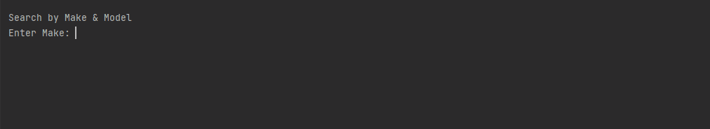

# Car Dealership

A CLI application for managing car dealerships, including all dealership vehicles. The main menu contains functions that allow the user to pull a list of vehicles based on the selected search option. The vehicle list is returned as table that displays the 8 properties of each vehicle. The user is also given the option to remove and add vehicles to ensure up-to-date representation of the dealership.


## Overview

- [Setup](#setup)

- [Features](#features)

- [Demo](#demo)

- [Future Work](#future-work)

- [Contact](#contact)

## Setup
**Prerequisites**


Make sure Java and Maven are installed on your system.
You can check by running the following commands in your terminal:

```
java -version  
mvn -version
```
If they are not installed, download and install [Java](https://www.oracle.com/java/technologies/javase-downloads.html) and  [Maven](https://maven.apache.org/download.cgi).

**Clone The Repository**

In your terminal, navigate to the directory where you'll keep the project and clone this repository to your local machine. You can do this using the following command:
```
     git clone https://github.com/JalesiaGriffin/car-dealership.git
```

## Features
- [Find vehicles within a price range](#price-range)
- [Find vehicles by make/model](#make-model)
- [Find vehicles by year range](#year-range)
- [Find vehicles by color](#color)
- [Find vehicles by mileage](#mileage)
- [Find vehicles by type](#type)
- [List all vehicles](#all-vehicles)
- [Add a vehicle](#add)
- [Remove a vehicle](#remove)

### **Special Feature**
```
Public class UserInterface()
```
This class contains everything the user sees and interacts with. Separating these methods into its own class, enhances the code readability and organization
while also making it easier to manage any bugs.

## Demo
### Menu

### Price Range

### Make Model

### Year Range

### Color

### Mileage

### Type

### All Vehicles

### Add

### Remove


## Future Work
- [ ] Vehicle history reports
- [ ] Track vehicle availability

## Contact
Email: jalesiagriffin@outlook.com

Project Link:[https://github.com/JalesiaGriffin/car-dealership](https://github.com/JalesiaGriffin/car-dealership)
